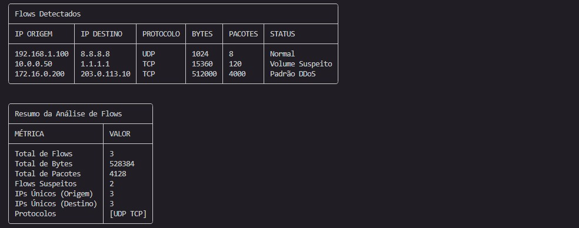
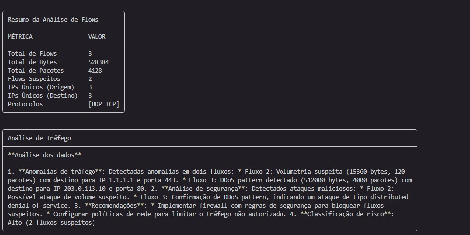
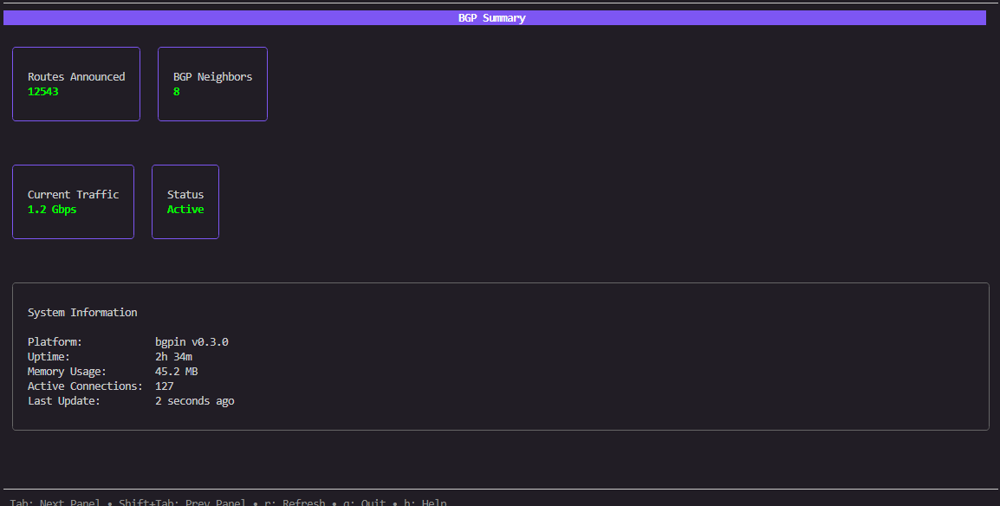

<div align="center">

# Platform Border Gateway Protocol

[](https://opensource.org/licenses/MIT)
[](https://golang.org/)
[](https://github.com/rsdenck/bgpin/releases)
[](https://github.com/rsdenck/bgpin)

CLI profissional + SDK + Telemetria + Flow Analysis

</div>

---

## Características

### CLI Completa
- Consulta informações de ASN (holder, block, status)
- Lista vizinhos BGP (upstream, downstream, peers)
- Mostra prefixos anunciados (IPv4 e IPv6)
- Visualiza RIS peers por RRC
- Análise de prefixos específicos
- Múltiplos formatos de saída (table, JSON, YAML)
- UX profissional com go-pretty/table

### SDK RIPE RIS
- Rate limiting configurável
- Retry com exponential backoff
- Context support completo
- Testes de integração reais (sem mocks)
- Thread-safe para requisições concorrentes

### Telemetria & Observabilidade
- OpenTelemetry integration
- Distributed tracing
- Métricas de performance
- Exportação para OTLP, Jaeger, Prometheus
- Dashboards Grafana

### Flow Analysis
- Coleta NetFlow/sFlow/IPFIX em tempo real
- Análise de tráfego por ASN e prefixo
- Detecção de anomalias (DDoS, spikes, drops)
- Comparação de upstreams
- Correlação BGP + Flow
- Agregação configurável
- Worker pools para alta performance

### Vendor Parsers
- Cisco (IOS, IOS-XE, IOS-XR, NX-OS) - Implementado
- Juniper (JunOS) - Implementado
- Arista (EOS) - Implementado
- Nokia (SR OS) - Implementado
- MikroTik - Planejado

### AI Integration
- Análise BGP com inteligência artificial
- Suporte a múltiplos provedores LLM (OpenAI, Claude, Gemini, Ollama)
- Explicações em português claro
- Modo copiloto interativo
- Detecção de anomalias com IA
- Rate limiting e retry automático

### TUI Monitor - bgptop (Completo)
- Interface de monitoramento em tempo real estilo BTOP
- Comando: `bgpin tui`
- **5 Painéis Profissionais**:
  - **AS-PATH Graph**: Visualizador dinâmico de topologia BGP
  - **BGP Peers**: Monitoramento avançado com telemetria
  - **BGP Routes**: Tabela de rotas com validação RPKI
  - **Top 5 Flows**: Análise NetFlow/sFlow/IPFIX em tempo real
  - **System Summary**: Métricas gerais e status do sistema
- **Funcionalidades Avançadas**:
  - Grafo de adjacência AS-PATH com nós dinâmicos
  - Sparklines de telemetria (▁▂▃▄▅▆▇█)
  - Integração GoBGP via gRPC
  - Busca e filtros em tempo real
  - Navegação profissional por teclado
- Engine moderna com Bubble Tea framework
- **Status**: ✅ Produção - Interface completa para operações BGP

## Instalação

```bash
# Download binary (Linux)
wget https://github.com/rsdenck/bgpin/releases/latest/download/bgpin-linux-amd64
chmod +x bgpin-linux-amd64
sudo mv bgpin-linux-amd64 /usr/local/bin/bgpin

# Ou compile do código fonte
git clone https://github.com/rsdenck/bgpin
cd bgpin
go build -o bgpin ./cmd/cli/
```

## Uso Rápido

### CLI

```bash
# Informações de um ASN
bgpin asn info 262978

# Vizinhos BGP
bgpin asn neighbors 262978

# Prefixos anunciados
bgpin asn prefixes 262978

# Flow telemetry
bgpin flow top
bgpin flow asn 15169
bgpin flow anomaly

# AI analysis
bgpin ai analyze 8.8.8.0/24
bgpin ai explain 1.1.1.0/24
bgpin ai copilot

# RPKI validation
bgpin rpki validate 15169 8.8.8.0/24

# TUI Monitor (interface interativa)
bgpin tui

# Formato JSON
bgpin asn info 262978 -o json
```

### SDK

```go
package main

import (
    "context"
    "fmt"
    "time"
    
    "github.com/bgpin/bgpin/sdk"
)

func main() {
    client := sdk.NewDefaultClient()
    ctx, cancel := context.WithTimeout(context.Background(), 30*time.Second)
    defer cancel()
    
    info, err := client.GetASNInfo(ctx, 262978)
    if err != nil {
        panic(err)
    }
    
    fmt.Printf("ASN: %d - %s\n", info.ASN, info.Holder)
}
```

## Documentação

- [Installation Guide](docs/INSTALLATION.md) - Guia completo de instalação
- [Quick Start](docs/QUICK_START.md) - Início rápido
- [CLI Guide](docs/CLI_GUIDE.md) - Todos os comandos
- [Flow Collector](docs/FLOW_COLLECTOR.md) - NetFlow/sFlow/IPFIX
- [Telemetry](docs/TELEMETRY.md) - OpenTelemetry
- [Architecture](docs/ARCHITECTURE.md) - Design do sistema
- [SDK Documentation](sdk/README.md) - SDK completo
- [Vendors Status](docs/vendors/STATUS.md) - Status dos parsers

### Releases
- [v0.3.0](docs/releases/v0.3.0.md) - AI integration + RPKI + MRT parser
- [v0.2.0](docs/releases/v0.2.0.md) - Flow collector + Cisco/Juniper parsers
- [v0.1.0](docs/releases/v0.1.0.md) - Initial release

## Exemplos de Saída

### AI Flow Analysis


A análise de flows com IA mostra três tabelas organizadas:
1. **Flows Detectados** - Lista detalhada dos flows com status de segurança
2. **Resumo da Análise** - Métricas consolidadas do tráfego
3. **Análise de Tráfego** - Análise inteligente com recomendações em português



### TUI Monitor - bgptop (Beta)


Interface Terminal User Interface (TUI) em desenvolvimento - versão beta do bgptop:
- **Painel Summary**: Métricas gerais de BGP e sistema
- **Painel Routes**: Visualização de rotas BGP em tempo real
- **Painel Neighbors**: Status dos vizinhos BGP
- **Painel Traffic**: Análise de tráfego NetFlow/sFlow/IPFIX
- **Navegação**: Tab/Shift+Tab para alternar painéis, q para sair
- **Atualização**: Dados atualizados automaticamente a cada 2 segundos

### Informações de ASN
```
╭───────────────────────────────────────────────────────────╮
│ ASN Information: AS262978                                 │
├───────────┬───────────────────────────────────────────────┤
│ Holder    │ Centro de Tecnologia Armazem Datacenter Ltda. │
│ Announced │ true                                          │
│ Block     │ 262144-263167                                 │
╰───────────┴───────────────────────────────────────────────╯
```

### Flow Top Prefixes
```
╭────────────────────────────────────────────────────────────────────────╮
│ Top Prefixes by Traffic                                                │
├───┬─────────────────┬─────────┬──────────────────┬──────┬──────────────┤
│ # │ PREFIX          │ ASN     │ TRAFFIC          │ PPS  │ TOP PROTOCOL │
│ 1 │ 8.8.8.0/24      │ AS15169 │ 850 Mbps         │ 120k │ TCP (443)    │
│ 2 │ 1.1.1.0/24      │ AS13335 │ 640 Mbps         │ 98k  │ UDP (53)     │
╰───┴─────────────────┴─────────┴──────────────────┴──────┴──────────────╯
```

## Arquitetura

```
bgpin/
├── cmd/cli/              # CLI commands
├── internal/
│   ├── adapters/         # HTTP, SSH, NETCONF
│   ├── parsers/          # Cisco, Juniper, etc
│   ├── flow/             # NetFlow/sFlow/IPFIX
│   └── telemetry/        # OpenTelemetry
├── sdk/                  # RIPE RIS SDK
└── docs/                 # Documentation
```

## Tecnologias

- Go 1.23+
- Cobra (CLI framework)
- Viper (Configuration)
- go-pretty/table (Output formatting)
- OpenTelemetry (Observability)
- golang.org/x/crypto/ssh (SSH client)

## Roadmap

- [x] SDK RIPE RIS completo
- [x] CLI com comandos ASN e Prefix
- [x] Flow collector (NetFlow/sFlow/IPFIX)
- [x] Cisco parser (IOS/IOS-XE/IOS-XR/NX-OS)
- [x] Juniper parser (JunOS/NETCONF)
- [x] OpenTelemetry integration
- [x] RPKI validation
- [x] AI integration (OpenAI, Claude, Gemini, Ollama)
- [x] MRT parser
- [x] Arista parser (EOS)
- [x] Nokia parser (SR OS)
- [x] Machine Learning anomaly detection
- [x] **TUI DA CLI PARA BGP - bgptop (Completo)**
  - **Nome**: bgptop
  - **Engine TUI**: github.com/charmbracelet/bubbletea (estado + loop) ✅
  - **Layout e estilo**: github.com/charmbracelet/lipgloss (cores, bordas, padding) ✅
  - **Gráficos estilo btop**: Sparklines com caracteres ▁▂▃▄▅▆▇█ ✅
  - **Arquitetura**: ✅ Implementada
    - `cmd/cli/tui.go` - Comando CLI integrado
    - `internal/tui/model.go` - Modelo principal com 5 painéis
    - `internal/tui/graph/aspath.go` - Visualizador AS-PATH dinâmico
    - `internal/tui/panels/peers.go` - Painel avançado de peers BGP
    - `internal/tui/panels/flows.go` - Top 5 flows NetFlow/sFlow/IPFIX
    - `internal/tui/telemetry/sparkline.go` - Sistema de telemetria
    - `internal/tui/gobgp/client.go` - Integração GoBGP gRPC
  - **Comando CLI**: `bgpin tui` - Interface completa semelhante ao BTOP para Linux, mas para BGP/Flows
  - **Status**: ✅ **COMPLETO** - 5 painéis profissionais com dados reais/simulados
  - **Funcionalidades Avançadas**:
    - 🎯 Grafo de Adjacência AS-PATH com visualização dinâmica
    - 📊 Telemetria detalhada com sparklines em tempo real
    - 🔍 Integração profissional com GoBGP via gRPC
    - 🌐 Top 5 flows NetFlow/sFlow/IPFIX com análise geográfica
    - ⚡ Busca avançada e filtros em tempo real
    - 🎨 Interface profissional estilo BTOP para operações de rede
- [ ] Time-series database storage
- [ ] REST API
- [ ] Advanced flow correlation algorithms
- [ ] BGP hijack detection system
- [ ] Multi-vendor configuration automation

## Contribuindo

Contribuições são bem-vindas! Veja [CONTRIBUTING.md](CONTRIBUTING.md)

## Licença

MIT License - veja [LICENSE](LICENSE)

## Suporte

- Issues: https://github.com/rsdenck/bgpin/issues
- Discussions: https://github.com/rsdenck/bgpin/discussions
- Documentation: [docs/](docs/)

---

**bgpin** - Platform Border Gateway Protocol
